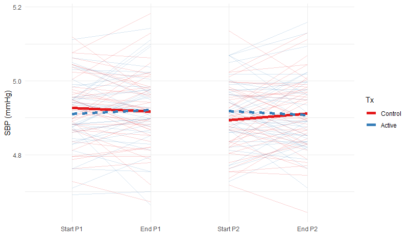

# Statistical methods

Continuous variables were described by their means and SDs, medians and IQRs, and their range; while categorical variables were described by their counts and percentages in each category. Average treatment effects were estimated using mixed effects models with a random effect for participant. All reported models were adjusted for the sex of the participant (to correspond to the sex-stratified randomization lists). We also estimated a model with an added period effect, and another that also included an adjustment for period-specific baseline values of the outcome measure (REF). Following advice from Senn (REF), we did not formally test for a carry-over effect. All model-based estimates are reported with 95% CIs and p-values based on conditional F-tests with Kenward-Roger degrees of freedom (REF). We did not apply any adjustment for multiple testing, but have provided enough information for the reader to do so it they wish. Data were analysed on an intent-to-treat basis (i.e. without consideration for intervention compliance).

To evalaute the possilbity of heterogeneity of treatment effects, we 

All analyses were conducted using R language for statistical computing software V3.6.0 (2019-04-26). We used the lme4 package (REF) to estimate mixed effects models; ggplot2 (REF) to generate plots; and sjPlot to produce tables of model results. All anonymized data and the code used to analyze it and generate outputs can be found on the Open Science Framework (https://osf.io/zq4y9/). 

Table 1. Respondent characteristics

Variable              N    Mean SD        Median [IQR]        (Min, Max)    
--------------------  ---  -------------  ------------------  --------------
sequence              83   0.5 ± 0.5      0 (0, 1)            (0, 1)        
sex                   83                                                    
Male                       46 (55.4%)                                       
Female                     37 (44.6%)                                       
age_screening         83   57.7 ± 6.2     57 (52.5, 63)       (45, 70)      
height_m              83   1.7 ± 0.1      1.7 (1.6, 1.8)      (1.5, 1.9)    
weight_kg_screen      83   80.4 ± 13      80.9 (70.6, 91)     (53.5, 106.3) 
bmi_screening         83   27.7 ± 3.5     27.9 (25, 29.9)     (20.4, 37.2)  
sbpscreening          83   140.4 ± 10.1   140 (132.5, 146)    (124, 171)    
dbpscreening          83   89.5 ± 8.8     89 (83.5, 95)       (67, 112)     
smoking_ever          83                                                    
No                         60 (72.3%)                                       
Yes                        23 (27.7%)                                       
alcohol_consumption   83                                                    
No                         21 (25.3%)                                       
Yes                        62 (74.7%)                                       
physical_mins         55   43.7 ± 32.1    34.3 (19.6, 57.9)   (4.3, 148)    
tv_hours              82   1.9 ± 1.7      1.5 (1, 2.5)        (0, 12)       
sleep_hours           82   7 ± 1.1        7 (6.5, 8)          (3.5, 10)     
occupation            82                                                    
1                          37 (45.1%)                                       
2                          20 (24.4%)                                       
3                          15 (18.3%)                                       
4                          1 (1.2%)                                         
5                          9 (11%)                                          
educationcategory     82                                                    
1                          2 (2.4%)                                         
3                          22 (26.8%)                                       
4                          34 (41.5%)                                       
5                          24 (29.3%)                                       

Table 2. Blood pressure outcomes

Outcome    n_control   mean_control   sd_control   n_active   mean_active   sd_active   n_diff   Mean_diff   SD_diff  Estimate                     p
--------  ----------  -------------  -----------  ---------  ------------  ----------  -------  ----------  --------  -----------------------  -----
SBP               81            140         14.0         83           140        14.0       81        0.37      11.0  -0.078 (-2.92 to 2.77)    0.96
C SBP             82            140         14.0         81           140        15.0       80        1.10      11.0  0.47 (-2.33 to 3.27)      0.74
DBP               81             89          9.5         83            89         9.0       81       -0.26       7.6  -0.14 (-1.97 to 1.69)     0.88
C DBP             82             77          7.1         81            77         6.7       80       -0.31       6.5  -0.27 (-1.76 to 1.22)     0.72

Figure 1. Mixed-effect model estimated treatment effects for blood pressure outcomes. 
<!-- -->

Figure 2. Change in systolic blood pressure across the two study periods
<!-- -->

Heterogenity

  

<!-- -->

